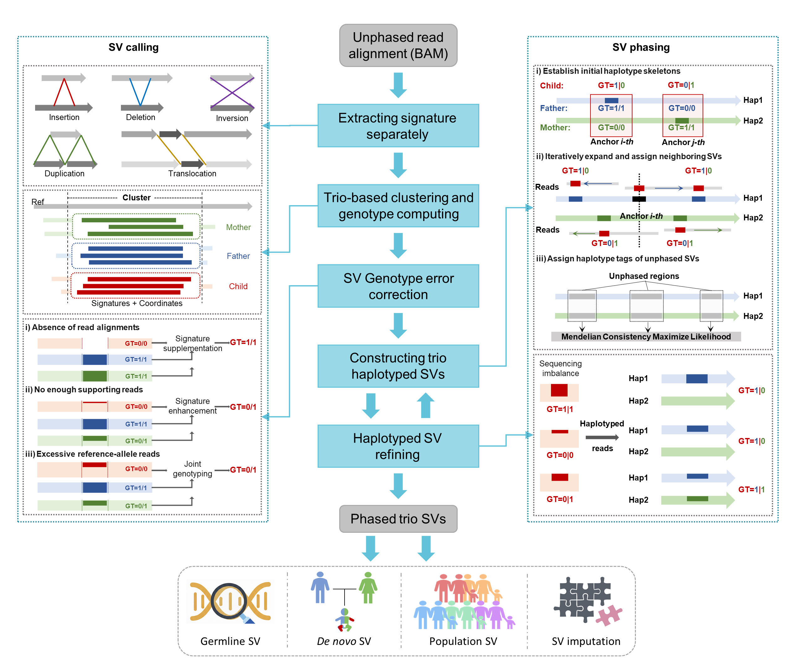
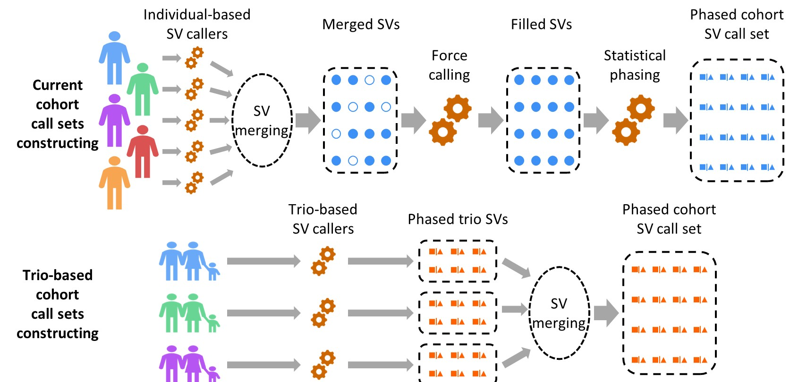
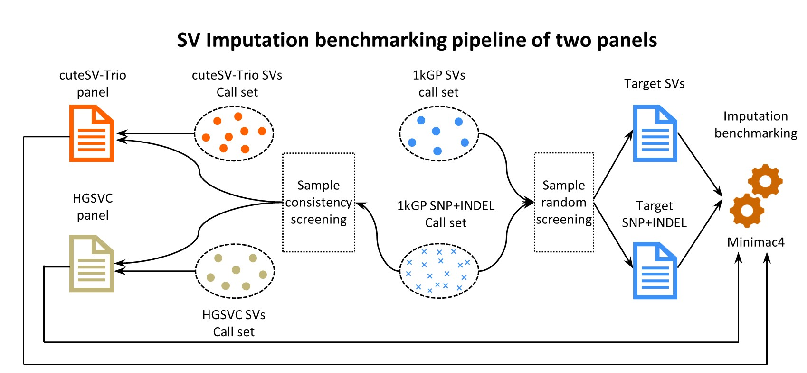

# cuteSV-Trio:Accurate and high-effectiveness long-read calling and phasing structural variant detector in family trios


<div align="center">
  <a target="_blank">
    
  </a>
</div>

------


## Contents


- [Introduction](#Introduction)
- [Workflow](#Workflow)
- [Installation](#Installation)
- [Dependence](#Dependence)
- [Usage](#Usage)
- [QuickDemo](#QuickDemo)
- [LatestUpdates](#LatestUpdates)
- [Contact](#Contact)


------


## Introduction

cuteSV-Trio, a haplotype-phased SV caller designed for trio-based low-coverage long-read sequencing data. cuteSV-Trio leverages Mendelian inheritance patterns and haplotype linkage information through novel multi-feature clustering strategies to achieve high-precision haplotype-aware SV detection and accurate de novo SV identification. The family clustering approach is applied to characterize genomic features between family signatures, combining an error-specific optimisation to correct common errors in SV detection. Our comprehensive evaluations demonstrate that cuteSV-Trio achieves superior cost-performance efficiency compared with tools for both SV variant calling and phasing across varying sequencing depths in trio samples. cuteSV-Trio outperforms existing SV calling methods while requiring fewer sequencing data for comparable accuracy. cuteSV-Trio additionally achieves obvious improvement in haplotype-phasing rates, detects truer de novo SVs compared to other approaches. Through systematic evaluation of trio modeling advantages, we also established quantitative evidence for enhanced resolution in de novo variation detection and improved specificity in TE classification. These advancements established a new paradigm for family genome analysis, fundamentally enabling cost-effective trio-based SV detection while providing the first computational evidence for inheritance-driven quality enhancement in datasets.


------


## Workflow
cuteSV-Trio utilizes low-coverage long-read alignments from three family members (i.e., two parents and their offspring) to detect haplotype-resolved SVs within the trio. The method consists of four major steps designed to achieve high-performance SV detection

<div align="center">
  <a target="_blank">
    
  </a>
</div>

**Step 1**: Extract SV signatures and their corresponding long-read alignment coordinates separately for each family member. Then, integrate these individual results into a unified, family-specific SV signature set.

**Step 2**: Apply the stepwise refinement clustering strategy proposed by cuteSV to group SV signatures based on their genomic coordinates and variant sizes. Next, separate alternative-allele-supporting reads and reference-allele-supporting reads according to the individual labels within each cluster. Then, use a Maximum Likelihood Estimation (MLE) model to compute preliminary genotypes for each SV in each individual.

**Step 3**: Assess the genotype of each SV locus at the family level using Mendelian inheritance patterns and identify inconsistencies for correction. By correction in three main scenarios, cuteSV-Trio utilizes the corresponding family-level cluster to calculate trio-based joint genotypes, which are then used to assist in correcting the offspring’s genotype.

**Step 4**: Leverage Mendelian inheritance patterns and long-read linkage information to construct haplotype-resolved SV callsets. CuteSV integrates the inheritance information and sequence linkage information of SV, correctly and conveniently assign each SV to the haplotype that maximizes Mendelian consistency.


------


## Installation

```
git clone https://github.com/QianZixi/cuteSV-Trio && cd cuteSVTrio/ && python setup.py install 
```


------


## Dependence

```
1. python3
2. scipy
2. pysam
3. Biopython
4. cigar
5. numpy
6. pyvcf3
7. scikit-learn
```

------


## Usage

```
cuteSVTrio <reference.fa> <offspring.sorted.bam> <father.sorted.bam> <nother.sorted.bam> <output.vcf> <work_dir>
```


------


| Key  Parameter        | Required | Description                                                  | Default        |
| --------------------- | -------- | ------------------------------------------------------------ | -------------- |
| --reference           | ✅        | The reference  genome in fasta format                        | *(no default)* |
| --input_offspring     | ✅        | Sorted  .bam file of offspring in family from NGMLR or Minimap2. | *(no default)* |
| --input_parent_1      | ✅        | Sorted  .bam file of father or only parent in family from NGMLR or Minimap2. | *(no default)* |
| --input_parent_2      | ✅        | Sorted  .bam file of mother in family from NGMLR or Minimap2. | *(no default)* |
| --output              | ✅        | Output  VCF format file.                                     | *(no default)* |
| --work_dir            | ✅        | Work-directory  for distributed jobs                         | *(no default)* |
| --min_support_list    | ✅        | Minimum  number of reads of each member of family that support a SV to be reported. It  is recommended to divide the data coverage by 6. | *(no default)* |
| --execute_stage       | ❌        | The  stage of this operation execution. 1:Run all member signature extraction  2:Run family signature clustering and variant generation 0:Execute both two  stage 1 and 2 | 0              |
| --performing_phasing  | ❌        | The  option of performing structural variant phasing.        | FALSE          |
| --family_mode         | ❌        | Mode  of members in family. M1:Family of offspring, father and mother M2:Family of  offspring and father/mother | M1             |
| --sequencing_platform | ❌        | The  option of sequencing platform affects a series of parameters in the signature  clustering. | NULL           |
| --threads             | ❌        | Number  of threads to use.                                   | 16             |

Other parameters can be found by -h/--help.


------


## QuickDemo

```
demo/fam.1.bam-------------------------The 30X bam of offspring
demo/fam.2.bam-------------------------The 30X bam of father
demo/fam.3.bam-------------------------The 30X bam of mother

rm -r work/ ; 
mkdir work/ ; 
cuteSVTrio --retain_work_dir --write_old_sigs --performing_phasing -p HiFI -g T2T -r demo/ref.fasta -o demo.vcf -w work/ --family_mode M1 --input_offspring demo/fam.1.bam --input_parent_1 demo/fam.2.bam --input_parent_2 demo/fam.3.bam --threads 32 --execute_stage 0 --min_support_list 5,5,5 ; 
```


------


## Population SVs callset constructing 

<div align="center">
  <a target="_blank">
    
  </a>
</div>

**The individual-based pipeline** containing four steps: individually detecting SV of each sample using traditional callers, merging SV of all samples, force calling SVs with genotype missing and statistical phasing using population-based tools. 

**The trio-based pipeline** based on cuteSV-Trio only contain two steps: discovery SVs in trio datas using cuteSV-Trio and merging SVs. 

Due to the full exploitation of family specific SV associations and the built-in SV phasing, cuteSV-Trio eliminates the force calling and statistical phasing steps in traditional pipelines, significantly shortening the construction process. It is worth mentioning that in the current construction pipeline, besides SV, SNVs also need to be characterized using four steps pipeline, but the new pipeline using cuteSV-Trio does not require SNV information.


------


## Reference panel bulding and benchmarking

<div align="center">
  <a target="_blank">
    
  </a>
</div>

Given that small variants and structural variants in the 1kGP were generated by two independent pipelines, we isolated small variant data of consistent samples and integrated it with the structural variant sets of cuteSV-Trio and HGSVC, thereby yielding two distinct reference panels, respectively. The partial structural and small variant component of 1kGP was utilized as array genotype data to evaluate the accuracy of imputed genotypes. The samples in the target dataset are randomly selected from 1kGP samples.


------


## LatestUpdates

v0.2.0 (June 10, 2025) : 

1. Add *CorrectType* tags to the SV supplemented by the three trio-based trio SV correction moethods and display them in the output VCF file. 
2. Add *parents_phasing* parameters to control whether the father and mother phase SV. By default, parents do not perform phasing, which can significantly reduce the spatiotemporal cost of phasing.

v0.3.0 (July 15, 2025) : 

1. Added processing to address some mosaic variations.
2. Addressing the issue of POS abnormalities in special chromosomes of hg38.


------


## Contact

For advising, bug reporting and requiring help, please post on [Github Issue](https://github.com/QianZixi/cuteSV-Trio) or contact xinli01@stu.hit.edu.cn.