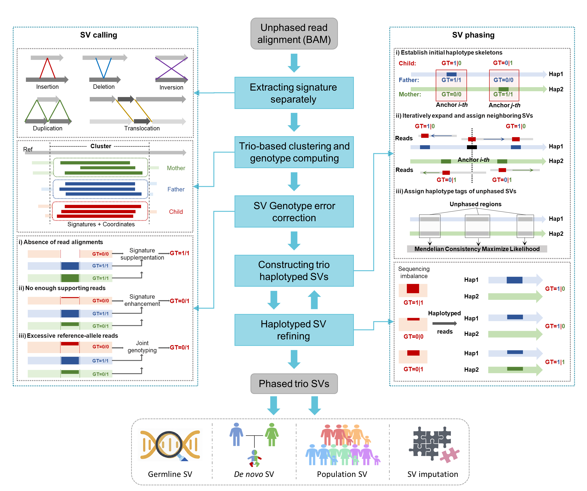
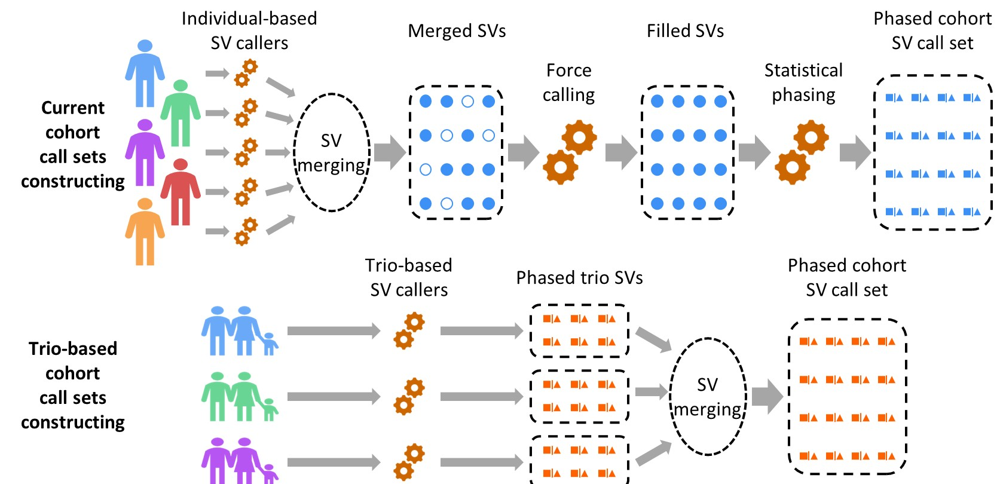

# cuteSV-Trio: Haplotype-Resolved and *De Novo* Structural Variant Detection from Low-Coverage Long-Read Sequencing of Family Trios


[](https://pypi.org/project/cuteSVTrio/1.0.0/)


<div align="center">
  <a target="_blank">
    
  </a>
</div>

------


## Contents


- [Introduction](#Introduction)
- [Workflow](#Workflow)
- [Installation](#Installation)
- [Dependence](#Dependence)
- [Usage](#Usage)
- [QuickDemo](#QuickDemo)
- [PopulationSVs callset constructing](#Population-SVs-callset-constructing)
- [Reference panel bulding and benchmarking](#Reference-panel-bulding-and-benchmarking)
- [LatestUpdates](#LatestUpdates)
- [Contact](#Contact)


------


## Introduction

Long-read sequencing technologies have advanced structural variant (SV) detection into an era of full-spectrum characterization. While family trio-based high-coverage sequencing enhances SV detection resolution, its prohibitive cost and limited utilization of genetic intrinsic properties pose significant barriers to widespread adoption. To address this challenge, we introduce cuteSV-Trio, a haplotype-resolved and *de novo* SV caller designed for low-coverage long-read trio sequencing data. cuteSV-Trio leverages Mendelian inheritance patterns and haplotype linkage information through novel family-wide clustering strategies to achieve high-precision haplotype-resolved SV detection and outstanding *de novo* SV identification. Benchmarking across orthogonal datasets demonstrates that cuteSV-Trio outperforms existing SV calling methods by 0.32%-25.92% in Genotype-F1 score. Moreover, cuteSV-Trio reduces haplotype-phasing error rates by ~17% and detects ~28% more precise *de novo* SVs. In addition, it is well-suited for constructing comprehensive population SV atlases and high-quality reference panels, improving the imputation accuracy by 33%. By dramatically reducing sequencing costs while improving detection accuracy, cuteSV-Trio represents a paradigm shift for trio-based and population-scale SV studies.


------


## Workflow
cuteSV-Trio utilizes low-coverage long-read alignments from three family members (i.e., two parents and their offspring) to detect haplotype-resolved SVs within the trio. The method consists of five major steps designed to achieve high-performance SV detection

<div align="center">
  <a target="_blank">
    
  </a>
</div>

**Step 1**: Extract SV signatures and their corresponding long-read alignment coordinates separately for each family member. Then, integrate these individual results into a unified, family-specific SV signature set.

**Step 2**: Apply the stepwise refinement clustering strategy proposed by cuteSV to group SV signatures based on their genomic coordinates and variant sizes. Next, separate alternative-allele-supporting reads and reference-allele-supporting reads according to the individual labels within each cluster. Then, use a Maximum Likelihood Estimation (MLE) model to compute preliminary genotypes for each SV in each individual.

**Step 3**: Assess the genotype of each SV locus at the family level using Mendelian inheritance patterns and identify inconsistencies for correction. By correction in three main scenarios, cuteSV-Trio utilizes the corresponding family-level cluster to calculate trio-based joint genotypes, which are then used to assist in correcting the family members’ genotype.

**Step 4**: Leverage Mendelian inheritance patterns and long-read linkage information to construct haplotype-resolved SV callsets. CuteSV integrates the inheritance information and sequence linkage information of SV, correctly and conveniently assign each SV to the haplotype that maximizes Mendelian consistency. 

**Step 5**: Afterwards, refine the SV genotypes of all members on the binary read sets after haplotype resolution. To address SV genotype errors caused by three types of sequencing reads imbalances, cuteSV-Trio refines SVs based on the distribution of haplotyped reads.


------


## Installation

### Option 1. Install by src

```
git clone https://github.com/XLeeHIT/cuteSV-Trio && cd cuteSVTrio/ && python -m pip install .
```

### Option 2. Install by BioConda

```
conda install cutesv-trio
```

### Option 3. Install by PyPi

```
pip install cuteSVTrio
```


------


## Dependence

```
1. python3
2. scipy
2. pysam
3. Biopython
4. cigar
5. numpy
6. pyvcf3
7. scikit-learn
```

------


## Usage

```
cuteSVTrio <reference.fa> <offspring.sorted.bam> <father.sorted.bam> <nother.sorted.bam> <output.vcf> <work_dir>
```


------


| Key  Parameter        | Required | Description                                                  | Default        |
| --------------------- | -------- | ------------------------------------------------------------ | -------------- |
| --reference           | ✅        | The reference  genome in fasta format                        | *(no default)* |
| --input_offspring     | ✅        | Sorted  .bam file of offspring in family from NGMLR or Minimap2. | *(no default)* |
| --input_parent_1      | ✅        | Sorted  .bam file of father or only parent in family from NGMLR or Minimap2. | *(no default)* |
| --input_parent_2      | ✅        | Sorted  .bam file of mother in family from NGMLR or Minimap2. | *(no default)* |
| --output              | ✅        | Output  VCF format file.                                     | *(no default)* |
| --work_dir            | ✅        | Work-directory  for distributed jobs                         | *(no default)* |
| --min_support_list    | ✅        | Minimum  number of reads of each member of family that support a SV to be reported. It  is recommended to divide the data coverage by 6. | *(no default)* |
| --execute_stage       | ❌        | The  stage of this operation execution. 1:Run all member signature extraction  2:Run family signature clustering and variant generation 0:Execute both two  stage 1 and 2 | 0              |
| --performing_phasing  | ❌        | The  option of performing structural variant phasing.        | FALSE          |
| --family_mode         | ❌        | Mode  of members in family. M1:Family of offspring, father and mother M2:Family of  offspring and father/mother | M1             |
| --sequencing_platform | ❌        | The  option of sequencing platform affects a series of parameters in the signature  clustering. | NULL           |
| --threads             | ❌        | Number  of threads to use.                                   | 16             |

Other parameters can be found by **-h/--help**.


------


## QuickDemo

```
demo/fam.1.bam-------------------------The 30X bam of offspring
demo/fam.2.bam-------------------------The 30X bam of father
demo/fam.3.bam-------------------------The 30X bam of mother

rm -r work/ ; 
mkdir work/ ; 
cuteSVTrio --retain_work_dir --write_old_sigs --performing_phasing -p HiFI -g T2T -r demo/ref.fasta -o demo.vcf -w work/ --family_mode M1 --input_offspring demo/fam.1.bam --input_parent_1 demo/fam.2.bam --input_parent_2 demo/fam.3.bam --threads 32 --execute_stage 0 --min_support_list 5,5,5 ; 
```


------


## Population SVs callset constructing

**Trio-based SV atlas built using cutesv-Trio can be accessed from [cuteMap](https://github.com/XLeeHIT/cuteMap).**

<div align="center">
  <a target="_blank">
    
  </a>
</div>

**The individual-based pipeline** containing four steps: individually detecting SV of each sample using traditional callers, merging SV of all samples, force calling SVs with genotype missing and statistical phasing using population-based tools. 

**The trio-based pipeline** based on cuteSV-Trio only contain two steps: discovery SVs in trio datas using cuteSV-Trio and merging SVs. 

Due to the full exploitation of family specific SV associations and the built-in SV phasing, cuteSV-Trio eliminates the force calling and statistical phasing steps in traditional pipelines, significantly shortening the construction process. It is worth mentioning that in the current construction pipeline, besides SV, SNVs also need to be characterized using four steps pipeline, but the new pipeline using cuteSV-Trio does not require SNV information.

```
# Construting population SV call set using cuteSV-Trio
# Detect SVs for each trio and duo using cuteSV-Trio

cuteSVTrio --performing_phasing -r ref.fasta -o trio.1.vcf -w work.trio.1/ --family_mode M1 --input_offspring trio.1/fam.1.bam --input_parent_1 trio.1/fam.2.bam --input_parent_2 trio.1/fam.3.bam --threads 32 --execute_stage 0 --min_support_list 5,5,5 ; 
cuteSVTrio --performing_phasing -r ref.fasta -o trio.2.vcf -w work.trio.2/ --family_mode M1 --input_offspring trio.2/fam.1.bam --input_parent_1 trio.2/fam.2.bam --input_parent_2 trio.2/fam.3.bam --threads 32 --execute_stage 0 --min_support_list 5,5,5 ; 
cuteSVTrio --performing_phasing -r ref.fasta -o duo.1.vcf -w work.duo.1/ --family_mode M2 --input_offspring duo.1/fam.1.bam --input_parent_1 duo.1/fam.2.bam --input_parent_2 duo.1/fam.3.bam --threads 32 --execute_stage 0 --min_support_list 5,5 ; 
cuteSVTrio --performing_phasing -r ref.fasta -o duo.2.vcf -w work.duo.2/ --family_mode M2 --input_offspring duo.2/fam.1.bam --input_parent_1 duo.2/fam.2.bam --input_parent_2 duo.2/fam.3.bam --threads 32 --execute_stage 0 --min_support_list 5,5 ; 

# Merge SVs using bcftools & Truvari
bcftools merge --force-samples -m none -o callset.vcf -l merge_vcf_list.txt # Each line in "merge_vcf_list.txt" is the path of the vcf file that needs to be merged
bgzip -f callset.vcf ; tabix -f callset.vcf.gz
truvari collapse -i callset.vcf -o callset.merged.vcf.gz -c callset.merged.collapse.vcf.gz -r 1000 -p 0 -P 0.7 -s 30 -S 100000
```


------


## Reference panel bulding and benchmarking

<div align="center">
  <a target="_blank">
    
  </a>
</div>

Given that small variants and structural variants in the 1kGP were generated by two independent pipelines, we isolated small variant data of consistent samples and integrated it with the structural variant sets of cuteSV-Trio and HGSVC, thereby yielding two distinct reference panels, respectively. The partial structural and small variant component of 1kGP was utilized as array genotype data to evaluate the accuracy of imputed genotypes. The samples in the target dataset are randomly selected from 1kGP samples.

```
# Taking chromosome 1 as an example
# First extract the samples from cuteSV-Trio, 1kGP and HGSVC and the relevant samples from imputation
python scripts/pick_samples_from_vcf.py chr1 
bgzip -f cuteSVTrio.chr1.overlap.sv.vcf ; tabix -f cuteSVTrio.chr1.overlap.sv.vcf.gz
bgzip -f HGSVC.chr1.overlap.sv.vcf ; tabix -f HGSVC.chr1.overlap.sv.vcf.gz
bgzip -f 1kGP.chr1.overlap.SNP_INDEL.vcf ; tabix -f 1kGP.chr1.overlap.SNP_INDEL.vcf.gz
bgzip -f 1kGP_chr1_SNP_INDEL.260.target.vcf ; tabix -f 1kGP_chr1_SNP_INDEL.260.target.vcf.gz

# Divide all SVs into two parts: target and answer (ground truth)
python scripts/split_vcf_file.py chr1
bgzip -f 1kGP_chr1_SV.260.target.vcf ; tabix -f 1kGP_chr1_SV.260.target.vcf.gz ; bcftools index 1kGP_chr1_SV.260.target.vcf.gz
bgzip -f 1kGP_chr1_SV.260.answer.vcf ; tabix -f 1kGP_chr1_SV.260.answer.vcf.gz ; bcftools index 1kGP_chr1_SV.260.answer.vcf.gz

# Bulid the cuteSV-Trio reference panel
bcftools concat 1kGP.chr1.overlap.SNP_INDEL.vcf.gz cuteSVTrio.chr1.overlap.sv.vcf.gz -o cuteSVTrio.1kGP.chr1.unsorted.vcf ; bgzip -f cuteSVTrio.1kGP.chr1.unsorted.vcf ; tabix -f cuteSVTrio.1kGP.chr1.unsorted.vcf.gz ; bcftools sort cuteSVTrio.1kGP.chr1.unsorted.vcf.gz -o cuteSVTrio.1kGP.chr1.panel.vcf ; bgzip -f cuteSVTrio.1kGP.chr1.panel.vcf ; tabix -f cuteSVTrio.1kGP.chr1.panel.vcf.gz 

# Bulid the HGSVC reference panel
bcftools concat 1kGP.chr1.overlap.SNP_INDEL.vcf.gz HGSVC.chr1.overlap.sv.vcf.gz -o HGSVC.1kGP.chr1.unsorted.vcf ; bgzip -f HGSVC.1kGP.chr1.unsorted.vcf ; tabix -f HGSVC.1kGP.chr1.unsorted.vcf.gz ; bcftools sort HGSVC.1kGP.chr1.unsorted.vcf.gz -o HGSVC.1kGP.chr1.panel.vcf ; bgzip -f HGSVC.1kGP.chr1.panel.vcf ; tabix -f HGSVC.1kGP.chr1.panel.vcf.gz ; 

# Bulid the target call set
bcftools concat 1kGP_chr1_SNP_INDEL.260.target.vcf.gz 1kGP_chr1_SV.260.target.vcf.gz -o 1kGP_chr1_all.260.unsorted.vcf ; bgzip -f 1kGP_chr1_all.260.unsorted.vcf ; bcftools sort 1kGP_chr1_all.260.unsorted.vcf.gz -o 1kGP_chr1_all.260.target.vcf ; bgzip -f 1kGP_chr1_all.260.target.vcf ; tabix -f 1kGP_chr1_all.260.target.vcf.gz

# Use minimac4 for SV imputation
minimac4 --compress-reference cuteSVTrio.1kGP.chr1.panel.vcf.gz > cuteSVTrio.1kGP.chr1.panel.msav -t 32
minimac4 --compress-reference HGSVC.1kGP.chr1.panel.vcf.gz > HGSVC.1kGP.chr1.panel.msav -t 32
minimac4 -f GT,HDS,GP -t 8 -c 5000000 cuteSVTrio.1kGP.chr1.panel.msav 1kGP_chr1_all.260.target.vcf.gz -o cuteSVTrio.1kGP.chr1.minimac4.vcf.gz
minimac4 -f GT,HDS,GP -t 8 -c 5000000 HGSVC.1kGP.chr1.panel.msav 1kGP_chr1_all.260.target.vcf.gz -o HGSVC.1kGP.chr1.minimac4.vcf.gz
```

------


## LatestUpdates

v0.2.0 (June 10, 2025) : 

1. Add *CorrectType* tags to the SV supplemented by the three trio-based trio SV correction moethods and display them in the output VCF file. 
2. Add *parents_phasing* parameters to control whether the father and mother phase SV. By default, parents do not perform phasing, which can significantly reduce the spatiotemporal cost of phasing.

v0.3.0 (July 15, 2025) : 

1. Added processing to address some mosaic variations.
2. Addressing the issue of POS abnormalities in special chromosomes of hg38.

v0.4.0 (November 9, 2025) : 
1. Add a method to correct gt based on the read distribution of SV on the two haps after phasing.
2. Add an optional local assembly module to correct potential errors across the whole genome.

v0.5.0 (December 10, 2025) : 
1. In the local assembly module, a function has been added to supplement child sequences from parent sequencing data based on sequence similarity.
2. Add an algorithm to correct genotypes based on Mendelian disorder in non-newborn svs.

v1.0.0 (April 16, 2026) : 
1. The official version accompanying the formal paper submission.

------


## Contact

For advising, bug reporting and requiring help, please post on [Github Issue](https://github.com/XLeeHIT/cuteSV-Trio) or contact xinli01@stu.hit.edu.cn.