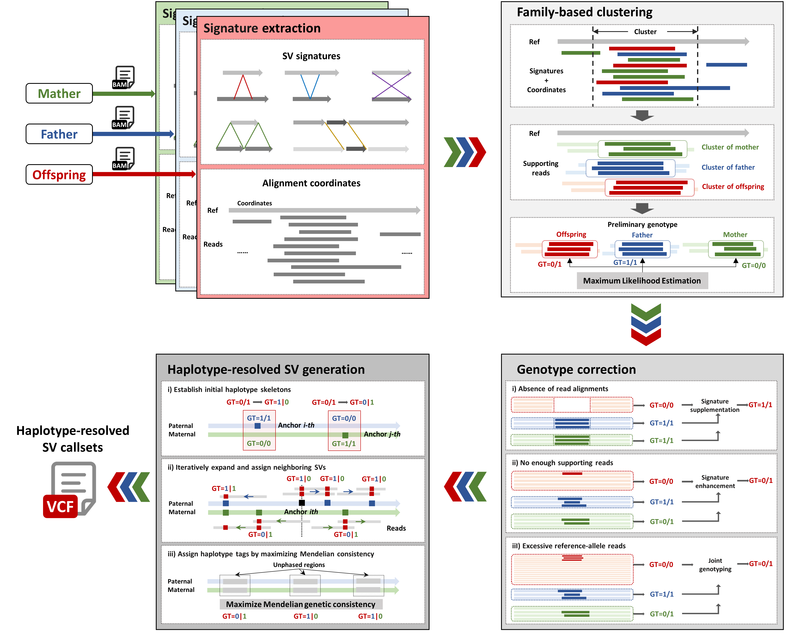

# cuteSV-Trio:Accurate and high-effectiveness long-read calling and phasing structural variant detector in family trios

<div style="display: flex; justify-content: center; width: 100%;">
    
</div>

```
                                               __________    __       __             ____________
                                              |   ____   |  |  |     |  |           |____________|
                          _                   |  |    |__|  |  |     |  |                |  |
 _______    _     _   ___| |___     ______    |  |          |  |     |  |                |  |
|  ___  |  | |   | | |___   ___|   / ____ \   |  |_______   |  |     |  |   _______      |  |     _   ___   __     ______
| |   |_|  | |   | |     | |      / /____\ \  |_______   |  |  |     |  |  |_______|     |  |    | | / __| |__|   / /  \ \
| |        | |   | |     | |      | _______|   __     |  |  \  \     /  /                |  |    | |/ /     __   / /    \ \
| |    _   | |   | |     | |  _   | |     _   |  |    |  |   \  \   /  /                 |  |    | |/      |  | | |      | |
| |___| |  | |___| |     | |_| |  \ \____/ |  |  |____|  |    \  \_/  /                  |  |    | |       |  |  \ \    / /
|_______|  |_______|     |_____|   \______/   |__________|     \_____/                   |__|    |_|       |__|   \_\__/_/
```

------


## Contents

- [Introduction](#Introduction)
- [Workflow](#Workflow)
- [Installation](#Installation)
- [Dependence](#Dependence)
- [Usage](#Usage)
- [QuickDemo](#QuickDemo)
- [LatestUpdates](#LatestUpdates)
- [Contact](#Contact)


## Introduction

cuteSV-Trio, a haplotype-phased SV caller designed for trio-based low-coverage long-read sequencing data. cuteSV-Trio leverages Mendelian inheritance patterns and haplotype linkage information through novel multi-feature clustering strategies to achieve high-precision haplotype-aware SV detection and accurate de novo SV identification. The family clustering approach is applied to characterize genomic features between family signatures, combining an error-specific optimisation to correct common errors in SV detection. Our comprehensive evaluations demonstrate that cuteSV-Trio achieves superior cost-performance efficiency compared with tools for both SV variant calling and phasing across varying sequencing depths in trio samples. cuteSV-Trio outperforms existing SV calling methods while requiring fewer sequencing data for comparable accuracy. cuteSV-Trio additionally achieves obvious improvement in haplotype-phasing rates, detects truer de novo SVs compared to other approaches. Through systematic evaluation of trio modeling advantages, we also established quantitative evidence for enhanced resolution in de novo variation detection and improved specificity in TE classification. These advancements established a new paradigm for family genome analysis, fundamentally enabling cost-effective trio-based SV detection while providing the first computational evidence for inheritance-driven quality enhancement in datasets.


## Workflow
cuteSV-Trio utilizes low-coverage long-read alignments from three family members (i.e., two parents and their offspring) to detect haplotype-resolved SVs within the trio. The method consists of four major steps designed to achieve high-performance SV detection

<div style="text-align: center;">
    
</div>


## Installation

```
git clone https://github.com/QianZixi/cuteSV-Trio && cd cuteSVTrio/ && python setup.py install 
```

------


## Dependence

```
1. python3
2. scipy
2. pysam
3. Biopython
4. cigar
5. numpy
6. pyvcf3
7. scikit-learn
```


## Usage

```
cuteSVTrio <reference.fa> <offspring.sorted.bam> <father.sorted.bam> <nother.sorted.bam> <output.vcf> <work_dir>
```

------


| Key  Parameter          | Description                                                  | Default  |
| ----------------------- | ------------------------------------------------------------ | -------- |
| --reference             | The  reference genome in fasta format                        | Required |
| --input_offspring       | Sorted  .bam file of offspring in family from NGMLR or Minimap2. | Required |
| --input_parent_1        | Sorted  .bam file of father or only parent in family from NGMLR or Minimap2. | Required |
| --input_parent_2        | Sorted  .bam file of mother in family from NGMLR or Minimap2. | Required |
| --output                | Output  VCF format file.                                     | Required |
| --work_dir              | Work-directory  for distributed jobs                         | Required |
| --execute_stage         | The  stage of this operation execution.                                                                                                                       1:Run all member signature extraction                                                                                                                         2:Run family signature clustering and variant generation                                                                                     0:Execute both two stage 1 and 2 | 0        |
| --performing_phasing    | The  option of performing structural variant phasing.        | FALSE    |
| --family_mode           | Mode  of members in family.                                                                                                                                M1:Family of offspring, father and mother                                                                                                                 M2:Family of offspring and father/mother | M1       |
| --min_support_list      | Minimum  number of reads of each member of family that support a SV to be reported. It is recommended to divide the data coverage by 6. | Required |
| --sequencing_platform   | The  option of sequencing platform affects a series of parameters in the signature  clustering. | NULL     |
| --threads               | Number of threads to use.                                    | 16       |

Other parameters can be found by -h/--help.


## QuickDemo

```
demo/fam.1.bam-------------------------The 30X bam of offspring
demo/fam.2.bam-------------------------The 30X bam of father
demo/fam.3.bam-------------------------The 30X bam of mother

rm -r work/ ; 
mkdir work/ ; 
cuteSVTrio --retain_work_dir --write_old_sigs --performing_phasing -p HiFI -g T2T -r demo/ref.fasta -o demo.vcf -w work/ --family_mode M1 --input_offspring demo/fam.1.bam --input_parent_1 demo/fam.2.bam --input_parent_2 demo/fam.3.bam --threads 32 --execute_stage 0 --min_support_list 5,5,5 ; 
```

## LatestUpdates

v0.2.0 (June 10, 2025) : 

1. Add *CorrectType* tags to the SV supplemented by the three trio-based trio SV correction moethods and display them in the output VCF file. 
2. Add *parents_phasing* parameters to control whether the father and mother phase SV. By default, parents do not perform phasing, which can significantly reduce the spatiotemporal cost of phasing.

v0.3.0 (July 15, 2025) : 

1. Added processing to address some mosaic variations.
2. Addressing the issue of POS abnormalities in special chromosomes of hg38.

## Contact

For advising, bug reporting and requiring help, please post on [Github Issue](https://github.com/QianZixi/cuteSV-Trio) or contact xinli01@stu.hit.edu.cn.